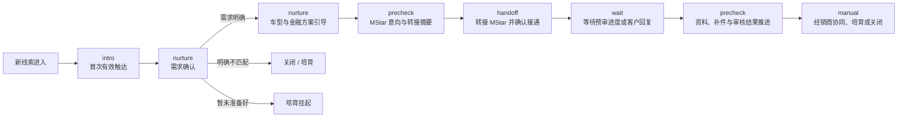
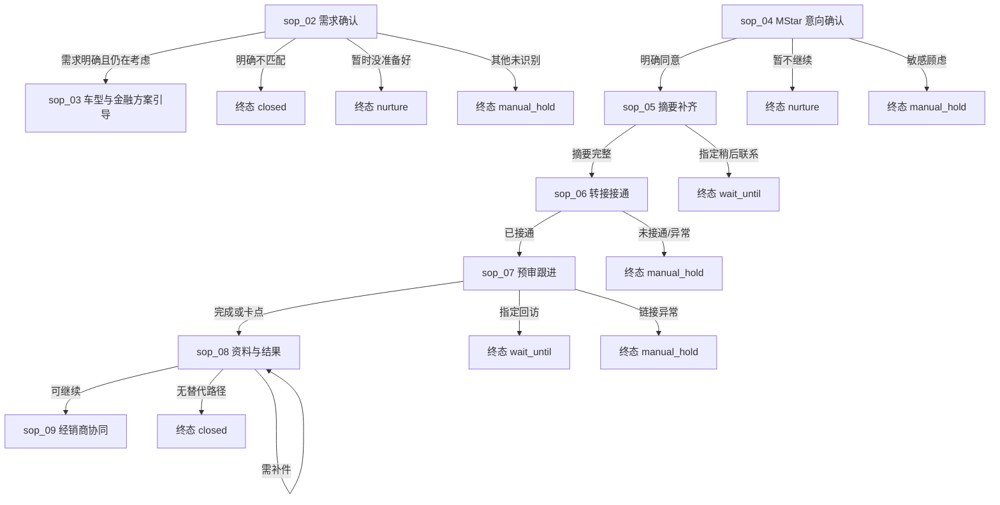

# SOP 节奏配置与节点类型：产品宣讲说明

> **适用范围**：AutoCava × MStar 墨西哥新车销售与金融线索 WhatsApp 跟进。
>
> **用途**：用于产品宣讲、销售运营培训和节奏配置评审，统一解释 SOP、节点类型、本步最大时长与 AI 执行边界。
>
> **对应资料**：
> - [《AutoCava_MStar_墨西哥新车销售与金融线索跟进SOP_2026版》](AutoCava_MStar_墨西哥新车销售与金融线索跟进SOP_2026版.md)
> - [《销售自定义跟进节奏·字段定义与任务进度方案》](销售自定义节奏-字段定义与任务进度方案.md)
> - 原型：`../../MOCK-节奏配置编辑器.html`
>
> **版本**：v1.1 · 2026-09-06

---

## 1. 一句话讲清产品逻辑

**SOP 决定“业务上下一步该做什么”，节点类型决定“系统以什么执行模式完成这一步”，节点配置决定“AI 在这一步的目标、边界、计时和流转条件”。**

以一条新车金融线索为例：

这不是一串固定话术。它是一套由条件驱动的业务节奏：客户回复、明确意向、同意转接、完成预审、发生异常或到达等待时限时，系统进入相应节点并执行规定动作。**同一个节点可以有多个出口，不同结果去不同地方。**

---

## 1.1 为什么不能再用“单一退出条件”

旧配置把多个业务结果写进同一句退出条件，再绑到同一个“跳到哪一步”：

> 退出条件：`核心需求足够判断下一步，或客户明确不匹配`  
> 跳到：`STEP 2 · 车型与金融方案引导`

这里其实有两个互斥命题：

| 命题 | 正确去向 | 若共用同一跳转会怎样 |
|---|---|---|
| 核心需求足够判断下一步 | → 车型与金融方案引导 | 正常 |
| 客户明确不匹配（只要二手车 / 不在服务范围） | → 关闭或转培育 | **错误地进入方案引导** |

因此产品规则改为：

1. **条件与去向必须一一绑定**：每条出口规则是一个对象，同时写清名称、条件、结果类型、目标节点或终态。
2. **禁止用 OR 把互斥结果塞进同一出口**。
3. **MVP 用 `transitions[]` 多出口表达分支**，不额外新增 `branch` 节点类型。
4. 每个节点必须有一条 **默认兜底出口**（`fallback`），避免未识别情况卡死。

---

## 2. SOP、节点类型和节点配置的关系

| 概念 | 它回答的问题 | 例子 | 谁主要负责配置 |
|---|---|---|---|
| **SOP 节奏（Rhythm）** | 整条线索跟进按什么业务顺序推进？ | 新线索 → 需求确认 → MStar 转接 → 预审推进 → 经销商协同 | 销售运营 / 业务负责人 |
| **节点（Step）** | 当前这一小步要完成什么？ | “MStar 转接摘要补齐” | 销售运营 |
| **节点类型（type）** | 系统以何种动作模式运行、如何呈现进度？ | `wait` 进入等待状态并显示倒计时 | 系统枚举，配置人选择适用类型 |
| **本步目标（objective）** | AI 在当前节点努力达成什么？ | 补齐城市、车型、首付、方便联系时间 | 销售运营 |
| **本步最大时长（duration）** | 本节点从进入开始最多允许持续多久？超时后应进入什么处理？ | 预审链接发送后最多等待 4 小时再识别卡点 | 销售运营 |
| **进入条件 / 出口规则** | 何时进入本节点？不同结果分别去哪里？ | `mstar.consent = true` → 补齐转接摘要；拒绝 → 培育 | 销售运营 |
| **节点提示词和字段配置** | AI 如何说、可读取什么、必须收集什么、不可承诺什么？ | 禁止承诺固定利率；采集 `contact.preferred_time` | 销售运营配置，敏感项走审核 |

### 讲解时可直接使用的比喻

- SOP 是业务路线图。
- 节点是路线图中的一个站点。
- 节点类型是站点的运营规则，不是销售自由撰写的话术。
- 本步目标是该站点的任务。
- 最大时长是该站点的超时阈值。
- 进入条件是进站门槛；**出口规则是分流闸门**（一个站点可有多个出口）。

---

## 3. “节点类型（系统枚举）”是什么意思

节点类型是系统预置的有限选项。选择类型后，系统据此决定：AI 可否主动动作、当前节点应该等待什么、要不要显示字段收集进度、是否需要人工接管标识等。

**节点类型与 SOP 强相关，但它不等于 SOP 本身。** SOP 规定业务动作；类型为该动作选择正确的系统运行模式。

| 类型 | 中文名称 | 一句话定义 | AI / 系统动作 | 适用场景 | 任务进度展示 |
|---|---|---|---|---|---|
| `intro` | 首次接洽 | 对新进入、可送达的线索完成首次有效沟通。 | 可主动发起首条合规 WhatsApp 消息；读取已有上下文，避免重复提问。 | T0 首次有效触达 | 单点节点 |
| `nurture` | 孵化 / 需求推进 | 通过一轮或多轮对话逐步澄清需求、提供参考并维持合理跟进。 | 围绕节点目标回应和推进；遵守频次与禁止承诺规则。 | 需求确认、车型与金融方案引导、D+3 换价值点、再激活 | 节点 + 当前轮次进度 |
| `precheck` | 结构化收集 / 预审推进 | 有目的地补齐用于判断、转接或推进的结构化信息。 | 提取并写回指定字段；已知信息不可重复询问；敏感资料走受控金融或人工流程。 | MStar 意向确认、转接摘要、资料补件、审核结果推进 | 节点 + 已收集字段数，例如 `3/8` |
| `wait` | 等待客户或外部结果 | 在等待窗口内观察客户回复、预审进度或外部团队状态。 | 默认不连续催促；到规定时点才按 SOP 进行一次合规确认、识别卡点或升级异常。 | 已发预审链接后的 2–4 小时进度确认 | 节点 + 剩余等待时间 |
| `handoff` | 转人工 / 跨团队交接 | 将具备必要上下文的线索转交 MStar、销售或运营，并确认真正接通。 | 生成并交接摘要；追踪接受、联系、接通状态；异常时转人工/运营处理。 | MStar 转接、客户要求真人、投诉、隐私顾虑、复杂金融判断 | 人工交接标记 |
| `manual` | 销售手动节点 | 必须由销售、MStar 或经销商实际完成，AI 不能自行承诺或替代执行。 | 等待或提醒责任人完成任务，保留记录；不虚构库存、报价、审批或交付结果。 | 经销商确认库存和正式报价、签约、交付、培育或关闭 | 节点 + 等待人工操作 |

### 关键边界

1. `handoff` 是一个与其他步骤同级的普通节点，可以放在节奏中的合适位置；但当前产品保存校验要求每条节奏至少包含一个 `handoff` 节点。
2. `wait` 表示“等待”，不是“在等待期内不断发消息”。跟进消息应由节点目标、触达频控和具体超时动作共同约束。
3. `precheck` 表示“结构化收集”，范围不仅是金融预审。它也适用于补齐转接摘要、资料状态和审核结果等字段。
4. `manual` 不表示流程失效，而是明确业务责任已经进入需人工完成的环节。
5. AI 不得因为节点类型为 `nurture` 或 `precheck` 而承诺固定利率、零首付、一定获批、库存或交付日期。

---

## 4. “本步最大时长”是什么意思

**本步最大时长是线索进入当前节点后的最长业务推进窗口。它不是单条消息的发送耗时，也不代表 AI 可以在该时间内持续或高频联系客户。**

一个完整的时长配置必须同时明确：

1. **何时开始计时**：线索满足进入条件时开始。例如“预审链接已发送”。
2. **什么情况提前退出**：客户回复、目标完成、客户拒绝、指定回访时间或异常发生时，立即进入对应下一步。
3. **超时后做什么**：到达时长仍未完成时，执行一次规定动作，例如轻提醒、切换价值点、识别卡点、转人工、转培育或关闭。

| SOP 节点示例 | 最大时长 | 正确理解 | 到期处理原则 |
|---|---:|---|---|
| T0 首次有效触达 | 立即 | 新线索进入后优先完成首触，不是连续沟通窗口。 | 消息成功发送后进入需求确认；发送失败进入异常处理。 |
| 需求确认 / D+1 轻提醒 | 24h | 客户回复时推进需求；若首触后 24 小时无回复，允许按 SOP 做一次轻量确认。 | 不重复发送长介绍，不因未回复而高频催促。 |
| 车型与金融方案引导 / D+3 换价值点 | 3d | 持续围绕客户已给信息提供参考，或在连续无回复至 D+3 时换一个真实价值点。 | 无回复时采用更短、更相关的触达；不凭空制造优惠或紧迫性。 |
| MStar 转接摘要补齐 | 24h | 在客户同意转接后，补齐必要的联系与需求信息。 | 摘要完成即提前转接；客户指定联系时间优先。 |
| 转接 MStar 并确认接通 | 30min | 在规定服务窗口内确认交接已被接受并产生有效联系。 | 已分配顾问不等于完成；未接通或异常升级人工/运营。 |
| 预审入口与 2–4 小时进度跟进 | 4h | 发送入口后给客户完成时间；到时识别没时间、链接问题或具体卡点。 | 只做与卡点相关的合规确认，不要求客户重做已完成内容。 |
| 资料、补件与审核结果推进 | 1d | 资料、审核状态和结果发生后，应在当天明确反馈、责任人和下一动作。 | 只提醒缺失项；审核结论以真实结果为准。 |
| 经销商协同、D+7 收口、培育或关闭 | 7d | 为人工正式推进、长期无回复收口或培育安排保留业务窗口。 | 客户指定回访时间优先于默认时长。 |

### 推荐字段名称

产品界面若需要降低理解成本，可将“本步最大时长”在说明文字中解释为：**本步最长推进窗口（超时阈值）**。

---

## 5. 当前 SOP 的节点映射

下表是《AutoCava_MStar_墨西哥新车销售与金融线索跟进 SOP》配置进节奏编辑器时的推荐映射，也是宣讲时可展示的完整示例。

| 顺序 | SOP 节点 | 节点类型 | 最大时长 | 进入条件摘要 | 出口规则摘要（多结果分流） |
|---:|---|---|---:|---|---|
| 1 | T0 首次有效触达 | `intro` | 立即 | 新线索且 WhatsApp 可送达 | 发送成功 → 需求确认；发送失败 → 异常人工；其他 → 人工兜底 |
| 2 | 需求确认 / D+1 轻提醒 | `nurture` | 24h | 客户回复，或首触后 24 小时仍无回复 | 需求明确 → 方案引导；不匹配 → 关闭；暂未准备好 → 培育；其他 → 人工 |
| 3 | 车型与金融方案引导 / D+3 换价值点 | `nurture` | 3d | 需求确认完成，或连续 3 天无回复 | 愿意了解金融 → MStar 意向；需专业判断 → 人工；暂缓 → 培育 |
| 4 | MStar 意向与授权确认 | `precheck` | 24h | 客户咨询实际金融条件或表达金融意向 | 同意 → 摘要补齐；暂不继续 → 培育；敏感顾虑 → 人工 |
| 5 | MStar 转接摘要补齐 | `precheck` | 24h | 已取得 MStar 联系同意 | 摘要完整 → 转接；指定时间 → 等待；无法取得信息 → 人工 |
| 6 | 转接 MStar 并确认接通 | `handoff` | 30min | 转接摘要已完整 | 已接通 → 预审跟进；未接通/渠道异常 → 人工运营 |
| 7 | 预审入口与 2–4 小时进度跟进 | `wait` | 4h | 预审链接已发出，或 MStar 要求客户开始预审 | 完成/卡点 → 资料推进；指定回访 → 等待；链接异常 → 人工 |
| 8 | 资料、补件与审核结果推进 | `precheck` | 1d | 资料补充、审核中、收到 MStar 结果或客户询问状态 | 可继续 → 经销商协同；需补件 → 留在本节点；无替代路径 → 关闭；其他 → 人工 |
| 9 | 经销商协同、D+7 收口、培育或关闭 | `manual` | 7d | 审核可继续、客户暂缓/拒绝/不匹配，或 D+7 连续无回复 | 正式推进 / 成交 / 培育 / 关闭 / 人工收口 |

### 5.1 当前 SOP 关键分支表（宣讲必讲）

| 节点 | 出口名称 | 条件摘要 | 去向 |
|---|---|---|---|
| sop_02 | 需求明确且仍在考虑 | 新车需求成立且方向足够 | → sop_03 |
| sop_02 | 明确不匹配 | 只要二手车 / 服务范围不匹配 | → `closed` |
| sop_02 | 暂时没准备好但未来可能购车 | 购车时间靠后或要求稍后联系 | → `nurture` |
| sop_04 | 明确同意 MStar 联系 | `mstar.consent = true` | → sop_05 |
| sop_04 | 暂不继续金融评估 | 拒绝继续 | → `nurture` |
| sop_05 | 转接摘要完整 | 摘要字段齐全 | → sop_06 |
| sop_05 | 指定稍后联系时间 | 已记录方便联系时间 | → `wait_until` |
| sop_06 | MStar 已接受并有效沟通 | accepted + contacted | → sop_07 |
| sop_06 | 未接通或渠道异常 | 号码 / 渠道异常 | → `manual_hold` |
| sop_07 | 预审完成或识别出卡点 | completed / blocker | → sop_08 |
| sop_07 | 客户指定回访时间 | 已记录回访时间 | → `wait_until` |
| sop_07 | 链接异常 | 链接不可用 | → `manual_hold` |
| sop_08 | 审核可继续或存在真实替代路径 | approved / alternative | → sop_09 |
| sop_08 | 需补件且动作明确 | pending 资料 + 下一动作 | 留在 sop_08 |
| sop_08 | 无替代路径 | rejected 且无可调整路径 | → `closed` |
| sop_09 | 正式推进 / 成交 / 培育 / 关闭 | CRM 状态 | 对应终态 |

---

## 6. 配置一个节点时，必须填清的六件事

宣讲时可以把每个节点理解为一张“AI 任务卡”。每张任务卡至少要回答以下问题：

| 配置项 | 必须讲清什么 | 好的写法 | 不清晰的写法 |
|---|---|---|---|
| 节点名称 | 销售看到就能知道当前业务阶段。 | `MStar 转接摘要补齐` | `信息处理` |
| 节点类型 | 选与业务动作相符的系统运行模式。 | `precheck` | 因为“看起来专业”而随意选择 |
| 本步目标 | 用 1–2 句说明这一节点的完成标准。 | `补齐语言偏好、城市、预算和方便联系时间，形成可转交 MStar 的摘要。` | `和客户聊清楚。` |
| 最大时长 | 定义等待/推进上限和超时动作。 | `24h；未完成时按客户指定时间或转培育处理。` | `尽快。` |
| 进入条件 | 指明满足什么事实后进入。 | `mstar.consent = true` | `客户差不多有兴趣。` |
| 出口规则 | 每个业务结果单独写清条件和去向。 | `同意 → sop_05`；`拒绝 → nurture`；`其他 → 人工兜底` | `视情况处理 / 或……` |

还应配置四类 AI 边界：

- **已有上下文**：AI 可读取、不得重复提问的信息。
- **本步采集字段**：本节点确实需要补齐并写回 CRM 的信息。
- **可用 HSM 模板**：仅选择已经通过 WhatsApp 平台审核的模板；未配置时不能主动发模板消息。
- **禁止承诺**：例如固定利率、零首付、100% 获批、未确认库存、未确认交付日期。涉及敏感金融或隐私问题应由规定流程或人工处理。

---

## 7. 客户体验与合规边界

### 7.1 客户指定时间优先

客户说“明天下午联系”时，系统应记录具体日期和时间，并以客户指定回访时间覆盖默认的 D+1、D+3 或节点最大时长。默认节奏是兜底，不应覆盖客户明确偏好。

### 7.2 发送失败不等于客户未回复

WhatsApp 消息 `Failed`、未送达、号码或模板异常属于渠道异常，必须进入检查、重试或人工处理；不得把它计入“客户无回复”，更不能因此提前进入 D+1、D+3 或关闭节奏。

### 7.3 不把等待窗口当成催促窗口

`wait` 及其他有时长的节点，均应限制为 SOP 规定的少量、相关且合规的动作。例如预审链接发出后的 4 小时窗口，重点是确认客户是否没时间、链接是否异常或遇到具体卡点。

### 7.4 不提前承诺本地政策或金融结果

当地环保车牌、限行豁免、通行资格、利率、首付、审批、库存和交付均需以具体城市、车型、当前政策和实际审核/经销商确认结果为准。

对墨西哥“绿牌”的安全表述：

> `Los requisitos y beneficios aplicables dependen de la entidad y del trámite vigente; primero debemos confirmarlo según su ciudad.`
>
> 适用的上牌要求和通行优惠取决于所在州及当前手续，需要根据客户所在城市先确认。

---

## 8. 产品宣讲 FAQ

### Q1：节点类型和 SOP 是一回事吗？

不是。SOP 是业务流程；节点类型是每一步的系统执行模式。一个 SOP 有多个节点，每个节点都要选择一个适合的类型。

### Q2：为什么销售不能自由创建新的节点类型？

节点类型会影响任务引擎的行为、进度 UI、计时和异常处理。允许销售自由创造类型会导致同名不同义、无法稳定渲染和无法验证。因此销售配置业务内容，系统维护有限的类型枚举。

### Q3：`wait` 节点是不是 AI 什么都不做？

不是。它表示 AI 处于受控等待状态：观察回复或外部结果，到预定时点执行一次规定的确认、卡点识别或异常升级。它不应持续主动催促。

### Q4：`precheck` 是否只能用于金融预审？

不是。它适用于任何必须结构化收集、核对或更新状态的任务，例如 MStar 转接摘要、资料补件、审核结果和联系偏好。

### Q5：`handoff` 是不是流程最后一步？

不是。它是普通的同级节点，可以在节奏中的任何适当位置出现。当前产品要求每条节奏至少有一个 `handoff`，以保证 AI 可以把需要人工处理的事项安全交接出去。

### Q6：本步最大时长是否等于客户在一个节点里最多能聊多久？

不是。它是节点的最长业务推进窗口。客户完成目标、拒绝、发生异常或指定回访时间时，都应提前退出或改按客户时间处理。

### Q7：`nurture` 节点可不可以一直跟进客户？

不可以。`nurture` 只定义“需求推进/孵化”模式；实际可触达次数、触达时间、退出条件和超时处理由 SOP 节奏及频控规则限制。

### Q8：AI 可以在 `manual` 节点替销售完成报价或承诺库存吗？

不可以。`manual` 用于标明必须由销售、MStar 或经销商完成的真实业务动作。AI 可以保留上下文、提示待办和记录进度，但不得虚构结果或作出未经确认的承诺。

### Q9：为什么“核心需求足够，或客户明确不匹配”不能写成一条退出条件？

因为这是两个互斥结果。前者应进入车型与金融方案引导，后者应关闭或转培育。条件与去向必须写在同一条出口规则里；MVP 用 `transitions[]` 多出口表达，不新增 `branch` 节点类型。

### Q10：每个节点一定要配默认兜底出口吗？

要。未识别情况必须有明确去向（通常转人工或培育），否则节奏会卡死或错误跳转。

---

## 9. 宣讲收尾口径

> 我们配置的不是一组自动群发话术，而是一条可审计、可交接、可控制频率的客户跟进 SOP。
>
> 每一个节点都明确：AI 现在要完成什么、最多等待多久、能读取和收集什么、哪些承诺不能说、**不同结果分别去哪里**。
>
> 因此 AI 能在 WhatsApp 上持续推进真实的新车和金融线索，同时在金融判断、资料隐私、正式报价、库存和交付等高风险环节及时交给正确的人；不匹配客户也不会被错误推进到下一销售节点。

---

## 10. 变更日志

- **v1.1**（2026-09-06）：补充分支规则
  - 新增 §1.1：单一退出条件不够、条件与去向必须绑定
  - 更新流程图与 §5 映射表为多出口摘要
  - 新增 §5.1 当前 SOP 关键分支表与 Mermaid
  - FAQ 新增 Q9 / Q10
- **v1.0**（2026-09-05）：首次宣讲说明